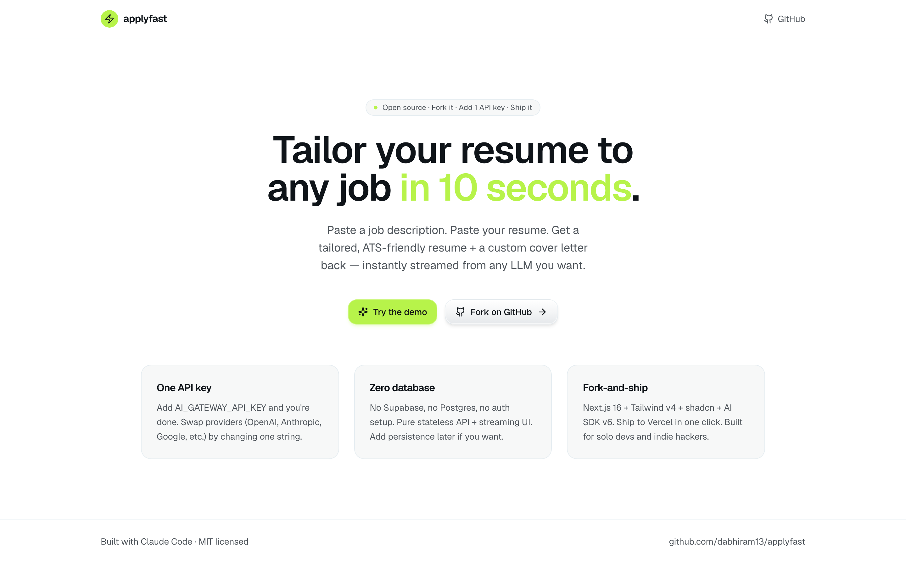

# applyfast

**Tailor your resume to any job in 10 seconds.** Open-source, fork-it-and-ship template.

Paste a job description + your resume → get a tailored, ATS-friendly resume + a custom cover letter back, streamed live. One API key. No database. No auth. Pure AI SDK + Next.js + Tailwind.

Built with [Claude Code](https://claude.com/claude-code) as an AI-assisted prototype.




---

## Quickstart

```bash
git clone https://github.com/dabhiram13/applyfast.git
cd applyfast
cp .env.example .env.local        # add your AI_GATEWAY_API_KEY
npm install
npm run dev
```

Open <http://localhost:3000>.

That's it. One env var, no database, no migrations, no Supabase setup.

## Get your API key

Grab a free `AI_GATEWAY_API_KEY` from [vercel.com/ai-gateway](https://vercel.com/ai-gateway) — it routes to OpenAI, Anthropic, Google, Mistral, and dozens of other providers through one key.

## Swap the model

Default model is `openai/gpt-4o-mini`. To swap, edit one line in [`app/api/tailor/route.ts`](app/api/tailor/route.ts):

```ts
const result = streamText({
  model: "anthropic/claude-haiku-4-5",   // or google/gemini-2.5-flash, etc.
  ...
});
```

Full provider list: [vercel.com/ai-gateway/docs](https://vercel.com/docs/ai-gateway).

## Deploy

One-click to Vercel:

[](https://vercel.com/new/clone?repository-url=https%3A%2F%2Fgithub.com%2Fdabhiram13%2Fapplyfast&env=AI_GATEWAY_API_KEY&envDescription=Get%20your%20key%20at%20vercel.com%2Fai-gateway)

## Stack

- [Next.js 16](https://nextjs.org) (App Router)
- [Tailwind CSS v4](https://tailwindcss.com)
- [shadcn/ui](https://ui.shadcn.com) primitives
- [AI SDK v6](https://ai-sdk.dev) + [Vercel AI Gateway](https://vercel.com/ai-gateway)
- [Zod](https://zod.dev) for input validation
- TypeScript

## Project structure

```
app/
  page.tsx              landing page
  tailor/page.tsx       the demo flow (client component, streams output)
  api/tailor/route.ts   the AI route (server, streamText + zod validation)
  layout.tsx            root layout
  globals.css           Tailwind v4 + design tokens (lime + charcoal)
components/ui/          shadcn primitives (button, card, input, textarea, etc.)
lib/utils.ts            cn() helper
```

## Ideas to fork-and-extend

- Add **file upload** for PDF resumes (use `pdf-parse` server-side)
- Add **persistence** with Supabase / Neon for application history
- Add **auth** with Clerk or NextAuth so users can save their resumes
- Add **interview prep**: same prompt structure, different system prompt
- Add **multi-model comparison**: stream from 2-3 models side-by-side and let users pick
- Add **scoring**: ask the model to also output a fit score (0-100) per resume bullet

## License

MIT. Fork it. Ship your own thing.
